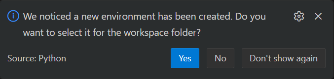

# EasyDiet

EasyDiet is a diet planning web app that generates personalized meal plans and shopping lists based on users’ fitness goals and dietary preferences.

## Architecture

| Layer | Details |
| --- | --- |
| Auth & Data | Supabase (Postgres + RLS) |
| Backend | FastAPI app in `backend/server.py` using Gemini |
| Frontend | React 19 + Vite SPA in `frontend/` |
| Tests | Pytest for backend utilities, Vitest wiring for the SPA |

## Supabase Config

Run this query in the Supabase SQL editor. Each table references `auth.users.id`; add Row Level Security policies that scope reads/writes to `auth.uid()`.

```sql
create table public.user_profiles (
  user_id uuid primary key references auth.users(id) on delete cascade,
  created_at timestamptz not null default now(),
  updated_at timestamptz not null default now(),
  fitness_goals text,
  dietary_restrictions text
);

create table public.conversations (
  id uuid primary key,
  user_id uuid not null references auth.users(id) on delete cascade,
  title text,
  last_message_preview text,
  created_at timestamptz not null default now(),
  updated_at timestamptz not null default now()
);

create table public.messages (
  id uuid primary key,
  conversation_id uuid not null references public.conversations(id) on delete cascade,
  user_id uuid references auth.users(id) on delete set null,
  role text check (role in ('user','model')),
  content text not null,
  created_at timestamptz not null default now()
);
```

## Environment Variable Config

**`backend/.env`**

```
GEMINI_API_KEY=
MODEL_NAME=
SUPABASE_URL=
SUPABASE_SERVICE_ROLE_KEY=
SUPABASE_JWT_SECRET=
ALLOWED_ORIGINS=
```

**`frontend/.env`**

```
VITE_SUPABASE_URL=
VITE_SUPABASE_ANON_KEY=
VITE_API_BASE=
```

## Local Development

### Backend

In a Terminal:
```bash
python --version
python3 --version
```

NOTE: If you don't have any python version greater than 3.12 you need to install it from the [website](https://www.python.org/downloads/).

Use python3 in place of python if its version is greater than 3.12 in all of the commands below:

Run in Git Bash:
```bash
python -m venv .venv
```
If you get this prompt, choose yes:



Then:

```bash
source .venv/bin/activate

# Use .venv/Scripts/python.exe or .venv/bin/python.exe in place of {python} if running into any errors
python -m pip install -r backend/requirements.txt
python -m uvicorn backend.server:app --reload --host 0.0.0.0 --port 8000
```

To run tests:

```bash
python -m pytest backend/tests
```

### Frontend

Run in Git Bash:
```bash
cd frontend
npm install
npm run dev
```
NOTE: You need to have npm and Node.js installed, if not download it from this [website](https://docs.npmjs.com/downloading-and-installing-node-js-and-npm)

To run tests:

```bash
npm run test
```

The Vite dev server runs on `http://localhost:5173` and forwards API calls to `VITE_API_BASE`.
